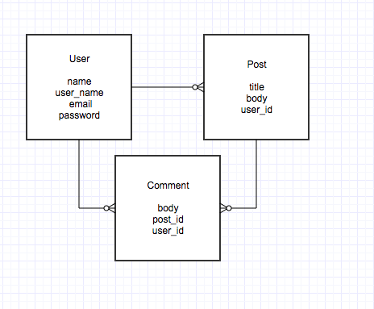

# Anime Hangout

Amine Hangout is just a place where anime fan can share and talk about the anime's they have watched. Also a place where they can kept track off all the anime they've watch.

Go to <a href="https://quiet-citadel-22184.herokuapp.com/">Anime Hangout</a>

## Technologies

* HTML
* CSS
* Ruby on Rails
* Javascript

## User Story

* As and new user I want to be able to create a new account
* When loggin want to be able to post anime shows I have watched
* When loggin want to be able to comment on other people's anime post
* When loggin want to be able to edit my account

## Dream Features

* list on side to easialy see all animes
* other user suggest anime to see
* when seen someone suggestion be able to add it to your list with a click of a button
* comments in a box so doesn't extend the scrolling for user page
* like another user's post or comment